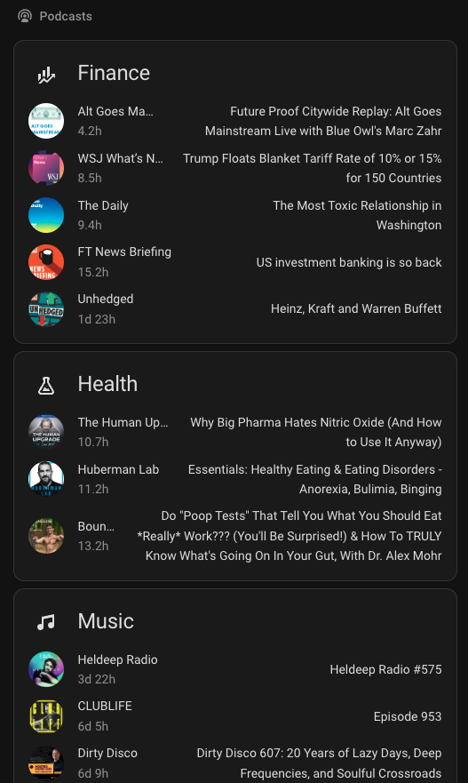

# PodcastIndex Home Assistant Integration

A Home Assistant integration that connects to the PodcastIndex API to fetch the latest episode of a podcast and provides functionality to play it on media players.

## Features

- Fetches the latest episode from any podcast feed via PodcastIndex API
- Displays episode information as a sensor with rich attributes
- Provides a service to search for and play the latest episode of any podcast on any media player
- Automatic updates every 5 minutes
- Proper authentication with PodcastIndex API

## Installation

### Manual Installation

1. Copy the `custom_components/podcast_index` folder to your Home Assistant `config/custom_components/` directory
2. Restart Home Assistant
3. Go to **Settings** → **Devices & Services** → **Integrations**
4. Click the **+ ADD INTEGRATION** button
5. Search for "PodcastIndex" and select it

### Configuration

You'll need the following information:

1. **Search Term or Podcast ID**: Enter a search term (e.g., "tech news", "comedy", "science") or a numeric PodcastIndex podcast ID.
2. **API Credentials**: Your PodcastIndex API credentials (stored in secrets.yaml)

### Setting up API Credentials

1. Go to [podcastindex.org](https://podcastindex.org)
2. Create an account or sign in
3. Navigate to your account settings
4. Generate API credentials (key and secret)
5. Add the credentials to your `secrets.yaml` file:

```yaml
# Add these lines to your secrets.yaml file
podcast_index_api_key: "your_api_key_here"
podcast_index_api_secret: "your_api_secret_here"
```

## Usage

### Sensor

The integration creates a sensor that shows:

- **State**: The title of the latest episode
- **Name**: The sensor name will show the podcast title when available (e.g., "PodcastIndex Tech News Latest Episode"), or fall back to the search term/ID if the title isn't available
- **Attributes**:
  - `title`: Episode title
  - `description`: Episode description
  - `publish_date`: When the episode was published (ISO format)
  - `duration`: Episode duration in HH:MM:SS format
  - `audio_url`: Direct link to the audio file
  - `podcast_title`: Name of the podcast (now properly populated for both search terms and podcast IDs)
  - `episode_number`: Episode number (if available)
  - `season_number`: Season number (if available)
  - `search_or_id`: The search term or podcast ID used to find the podcast
  - `feed_url`: The RSS feed URL of the podcast
  - `hours_since_publish`: Hours since the episode was published (rounded to 1 decimal place)
  - `podcast_icon`: URL to the podcast's icon/logo image

### Services

The integration provides several services for managing podcasts and playing episodes:

#### Search and Play

**Service**: `podcast_index.search_and_play`

**Parameters**:

- `entity_id`: The media player entity to play the episode on
- `search_term`: The search term or podcast ID to find the podcast (numeric values are treated as PodcastIndex podcast IDs)
- `volume` (optional): Volume level (0-100) to set before playing. If not provided, the current volume is maintained.

#### Add Search Term

**Service**: `podcast_index.add_search_term`

**Parameters**:

- `search_term`: The new search term to add (e.g., "tech news" or a podcast ID)

This service allows you to add additional podcast search terms to an existing PodcastIndex integration after the initial configuration. The integration will automatically reload to pick up the new search term and create a new sensor for it.

#### Remove Search Term

**Service**: `podcast_index.remove_search_term`

**Parameters**:

- `search_term`: The search term to remove (must match exactly)

This service allows you to remove a podcast search term from an existing PodcastIndex integration. The integration will automatically reload to reflect the changes. Note: You cannot remove the last search term as at least one is required.

**Example**:

```yaml
# Search for "tech news" and play the latest episode
service: podcast_index.search_and_play
target:
  entity_id: media_player.kitchen_speaker
data:
  search_term: "tech news"

# Play the latest episode from a specific podcast by PodcastIndex ID
service: podcast_index.search_and_play
target:
  entity_id: media_player.kitchen_speaker
data:
  search_term: "1234567"

# Play with volume set to 50%
service: podcast_index.search_and_play
target:
  entity_id: media_player.kitchen_speaker
data:
  search_term: "tech news"
  volume: 50
```

## Dashboard Configuration

### Example Dashboard with Auto-Entities

Here's an example of how to create a beautiful dashboard using the `auto-entities` and `template-entity-row` custom cards to display your podcast sensors in an organized, visually appealing way:



```yaml
type: vertical-stack
cards:
  - type: custom:auto-entities
    card:
      type: entities
      title: Finance
      icon: mdi:finance
    filter:
      include:
        - domain: sensor
          integration: podcast_index
          attributes:
            hours_since_publish: <=48
            friendly_name: /^Finance/
          options:
            type: custom:template-entity-row
            image: "{{ state_attr(config.entity, 'podcast_icon') }}"
            name: >-
              {{ state_attr(config.entity, 'friendly_name').split(' ')[1:-2] |
              join(' ') }}
            secondary: >
               
                {{ total_hours | round(1) }}h
              
                
                {% set remaining_hours = (total_hours % 24) | round(0) %}
                {{ days }}d
                
                  {{ remaining_hours }}h
                
              
            hold_action:
              action: more-info
            double_tap_action:
              action: more-info
            tap_action: |
              {
                "action": "call-service",
                "service": "media_player.play_media",
                "target": {
                  "device_id": "YOUR_SPEAKER_DEVICE"
                },
                "data": {
                  "media_content_id": "{{ state_attr(config.entity, 'audio_url') | default('') }}",
                  "media_content_type": "music"
                }
              }
    sort:
      method: attribute
      attribute: hours_since_publish
      numeric: true
  - type: custom:auto-entities
    card:
      type: entities
      title: Health
      icon: mdi:flask-outline
    filter:
      include:
        - domain: sensor
          integration: podcast_index
          attributes:
            hours_since_publish: <=168
            friendly_name: /^BioHack/
          options:
            type: custom:template-entity-row
            image: "{{ state_attr(config.entity, 'podcast_icon') }}"
            name: >-
              {{ state_attr(config.entity, 'friendly_name').split(' ')[1:-2] |
              join(' ') }}
            secondary: >
               
                {{ total_hours | round(1) }}h
              
                
                {% set remaining_hours = (total_hours % 24) | round(0) %}
                {{ days }}d
                
                  {{ remaining_hours }}h
                
              
            hold_action:
              action: more-info
            double_tap_action:
              action: more-info
            tap_action: |
              {
                "action": "call-service",
                "service": "media_player.play_media",
                "target": {
                  "device_id": "YOUR_SPEAKER_DEVICE"
                },
                "data": {
                  "media_content_id": "{{ state_attr(config.entity, 'audio_url') | default('') }}",
                  "media_content_type": "music"
                }
              }
    sort:
      method: attribute
      attribute: hours_since_publish
      numeric: true
  - type: custom:auto-entities
    card:
      type: entities
      title: Music
      icon: mdi:music
    filter:
      include:
        - domain: sensor
          integration: podcast_index
          attributes:
            hours_since_publish: <=168
            friendly_name: /Music/
          options:
            type: custom:template-entity-row
            image: "{{ state_attr(config.entity, 'podcast_icon') }}"
            name: >-
              {{ state_attr(config.entity, 'friendly_name').split(' ')[2:-2] |
              join(' ') }}
            secondary: >
               
                {{ total_hours | round(1) }}h
              
                
                {% set remaining_hours = (total_hours % 24) | round(0) %}
                {{ days }}d
                
                  {{ remaining_hours }}h
                
              
            hold_action:
              action: more-info
            double_tap_action:
              action: more-info
            tap_action: |
              {
                "action": "call-service",
                "service": "media_player.play_media",
                "target": {
                  "device_id": "YOUR_SPEAKER_DEVICE"
                },
                "data": {
                  "media_content_id": "{{ state_attr(config.entity, 'audio_url') | default('') }}",
                  "media_content_type": "music"
                }
              }
    sort:
      method: attribute
      attribute: hours_since_publish
      numeric: true
grid_options:
  columns: full
  rows: auto
```

### Required Custom Cards

To use this dashboard configuration, you'll need to install these custom cards:

1. **Auto-Entities**: [HACS](https://hacs.xyz/docs/categories/frontend) or [GitHub](https://github.com/thomasloven/lovelace-auto-entities)
2. **Template-Entity-Row**: [HACS](https://hacs.xyz/docs/categories/frontend) or [GitHub](https://github.com/thomasloven/lovelace-template-entity-row)

### Configuration Notes

- **Device ID**: Replace `"YOUR_SPEAKER_DEVICE"` with your actual media player device ID
- **Filter Patterns**: Adjust the `friendly_name` regex patterns to match your podcast sensor names
- **Time Filters**: Modify the `hours_since_publish` values to show episodes from different time periods
- **Categories**: Add or modify the card sections to match your podcast categories

## Troubleshooting

### Common Issues

1. **"Failed to connect to PodcastIndex API"**

   - Verify your API credentials are correctly set in secrets.yaml
   - Check that the search term or podcast ID is valid
   - Ensure your internet connection is working

2. **"PodcastIndex API credentials not found in secrets.yaml"**

   - Add the required credentials to your secrets.yaml file:
     ```yaml
     podcast_index_api_key: "your_api_key_here"
     podcast_index_api_secret: "your_api_secret_here"
     ```
   - Ensure the secrets.yaml file is in your Home Assistant config directory
   - Restart Home Assistant after adding the credentials

3. **"No episodes found"**

   - The search term or podcast ID might not return any results
   - The podcast might not have any episodes
   - The podcast might be private or require authentication

4. **Media player doesn't play the episode**
   - Ensure the media player supports the audio format
   - Check that the audio URL is accessible
   - Verify the media player entity ID is correct

### Logs

Enable debug logging by adding this to your `configuration.yaml`:

```yaml
logger:
  default: info
  logs:
    custom_components.podcast_index: debug
```

## Development

This integration is built using the latest Home Assistant patterns:

- Uses `DataUpdateCoordinator` for efficient data updates
- Implements proper async/await patterns
- Follows Home Assistant's entity naming conventions
- Uses modern config flow for setup
- Includes proper error handling and logging

## License

This project is licensed under the MIT License - see the LICENSE file for details.

## Contributing

Contributions are welcome! Please feel free to submit a Pull Request.
